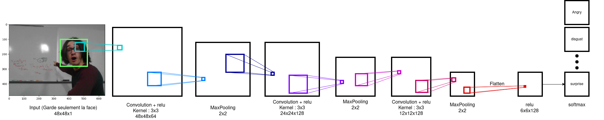

***LABO CONVOLUTIF***  

**Journal du labo convolutif**  

Indiquer votre choix parmi les projets de départ (effacer les autres): 
Classification des émotions : https://colab.research.google.com/drive/1dndIeVcxX6rzlycMpH1zDXsoPgbw_ocP#scrollTo=5TRgQqWJAClb  
Votre choix de CNN approuvé par le professeur  

Votre colab public : https://colab.research.google.com/drive/1XKYPnUlNYeQNOomAGOlb1Tdd_MvTkMKf?usp=sharing

**Dessin de blocs**

Votre dessin en format PNG (on doit le voir dans le README) :  couches_convolutives.drawio.png

Source du dessin (format xml ou autre) :  couches_convolutives.drawio

